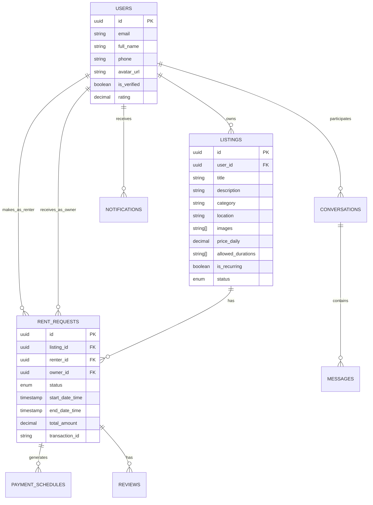

# RentFlow System Architecture

## Overview
RentFlow is a peer-to-peer rental marketplace platform consisting of a React Native (Expo) mobile application and a Supabase backend.

## System Components

### 1. Mobile App (Frontend)
- **Framework:** React Native with Expo.
- **Language:** TypeScript.
- **Navigation:** React Navigation (Native Stack + Bottom Tabs).
- **State Management:** React Context (Auth, Favorites).
- **Styling:** Custom theme based on colors and UI components.
- **Backend Integration:** `@supabase/supabase-js`.

### 2. Supabase (Backend-as-a-Service)
- **Database:** PostgreSQL.
- **Authentication:** Supabase Auth (integrated with `users` table).
- **Realtime:** Postgres Changes for listings, requests, and chat.
- **Storage:** Supabase Storage for listing images and avatars.
- **Logic:** PL/pgSQL functions and RPCs for state transitions.

## Data Schema

## Core Workflows

### 1. Rental Lifecycle (State Machine)
The system uses a robust state machine for rental requests:
- **PENDING**: Initial state when a renter makes a request.
- **ACCEPTED**: Owner approves the request.
- **HANDOVER_PENDING**: Renter confirms payment and item pickup.
- **LIVE**: Owner confirms handover; rental is active.
- **RETURN_PENDING**: Renter or Owner requests return.
- **COMPLETED**: Return approved; security deposit handled.

### 2. Security & Policies
- **Row Level Security (RLS)**: Enforced on all tables. Users can only see their own requests/messages.
- **RPC Functions**: `transition_request_status` ensures state transitions are valid and authorized based on roles (renter vs. owner).

## Next Steps Plan
1. **Feature Implementation**: Enhance the handover process with image verification.
2. **UI/UX**: Refine the search and filtering experience.
3. **Robustness**: Add more comprehensive error handling for network-unstable environments.
